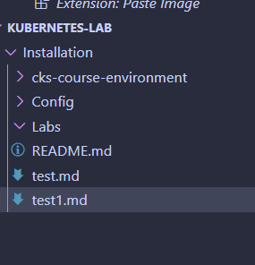

- [Introduction](#introduction)
- [Installation](#installation)
- [Login to Cloud Shell](#login-to-cloud-shell)
- [Configuration](#configuration)


#   Introduction

This is the introduction 

#   Installation


##   Prerequisities <!-- omit in toc -->

##   Steps  <!-- omit from toc -->
#  Login to Cloud Shell
#  Configuration


- [1](#1)

`sfsfs
sfdsfs
sfdsfsd
ffsdfsf
s
fs`

```
sfsdfsdfsfs
f
dsf
sdf
sfs
```